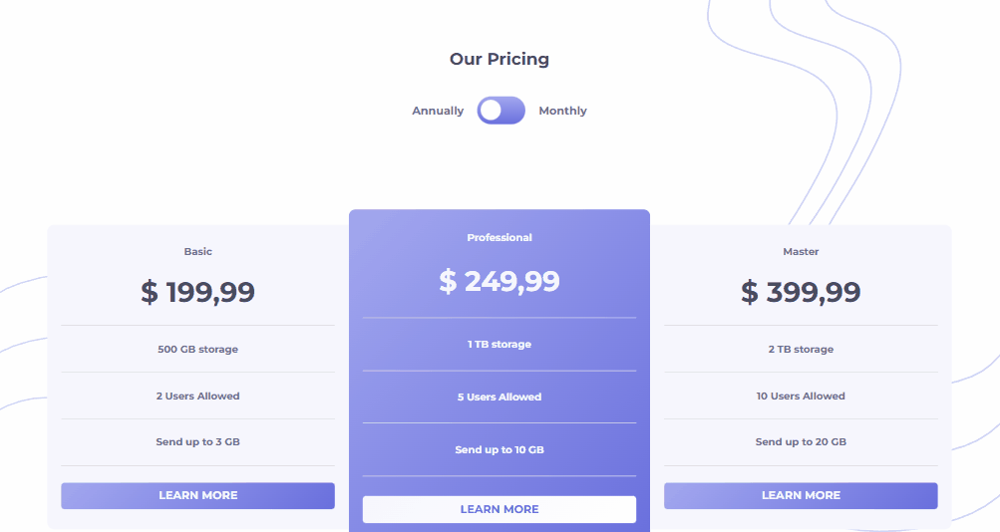

# Desafio de Alterar Preço com Switch Toggle - Frontend-Mentor

Este é um desafio de Alterar Preço com Switch Toggle proposto pelo site Frontend-Mentor.

## Tabela de Conteúdos

- [Visão Geral](#visão-geral)
    - [Imagens](#imagens)
    - [Link da página](#link)
- [Processo](#processo)
    - [Linguagens utilizadas](#linguagens-utilizadas)
    - [O que aprendi](#o-que-aprendi)
    - [Possíveis evoluções](#possíveis-evoluções)
- [Autor](#autor)

## Visão-geral

### Imagens

<br>

````
Versão de Desktop
````

   

<br>

````
Versão Mobile
````

 

### Link

- Página no GitHub Pages: <a href="https://julio-mansan2.github.io/alterar-preco">Clique aqui!</a>

## Processo

### Linguagens utilizadas

<br>

- Marcações semânticas de HTML5
- Propriedades de customização do CSS3
- Estruturas de JavaScript

<br>

### O que aprendi

<br>

- Criar um switch toggle:

````html

<span>Annually</span>
<input type="checkbox" id="switch" /><label for="switch">Toggle</label>
<span>Monthly</span>

````

````css

input[type=checkbox]{
    height: 0;
    width: 0;
    visibility: hidden;
  }
  
  label {
    cursor: pointer;
    text-indent: -9999px;
    width: 4.3rem;
    height: 2.5rem;
    background-image: linear-gradient(hsl(236, 72%, 79%), hsl(237, 63%, 64%));
    display: block;
    border-radius: 6.25rem;
    position: relative;
    margin-right: 0.6rem;
    transition: 0.3s;
  }

  label:hover {
    opacity: 0.6;
  }
  
  label:after {
    content: '';
    position: absolute;
    top: 0.3rem;
    left: 0.3rem;
    width: 1.8rem;
    height: 1.8rem;
    background: var(--white);
    border-radius: 5.6rem;
    transition: 0.3s;
  }
  
  input:checked + label {
    background-image: linear-gradient(hsl(236, 72%, 79%), hsl(237, 63%, 64%));
  }
  
  input:checked + label:after {
    left: calc(100% - 5px);
    transform: translateX(-100%);
  }

````

- Aplicar uma função ao switch toggle:

````html

<span>Annually</span>
<input type="checkbox" id="switch" /><label for="switch">Toggle</label>
<span>Monthly</span>

````
````javascript

const switchToggle = document.getElementById('switch')
const annuallyPrice = document.querySelectorAll('.price-annually')
const monthlyPrice = document.querySelectorAll('.price-monthly')

switchToggle.addEventListener('click', function (){
    
    for (let i = 0; i < monthlyPrice.length; i++) {
    if (switchToggle.checked) { 
       monthlyPrice[i].classList.add('aparecer')
       annuallyPrice[i].classList.add('ocultar')
       monthlyPrice[i].classList.remove('ocultar')
    } else {
        monthlyPrice[i].classList.remove('aparecer')
       annuallyPrice[i].classList.remove('ocultar')
       monthlyPrice[i].classList.add('ocultar')
    }
} })

````
<br>

### Possíveis evoluções

<br>

- Códigos mais compactos;
- Permitir cliques do teclado para a execução de determinada função.

<br>

## Autor

GitHub - <a href="https://github.com/julio-mansan2">julio-mansan2</a> <br>
Front-end Mentor - <a href="https://www.frontendmentor.io/profile/julio-mansan2">julio-mansan2</a> <br>
LinkedIn - <a href="https://www.linkedin.com/in/j%C3%BAlio-a-mansan-3415a7249/">Júlio A.</a> <br>